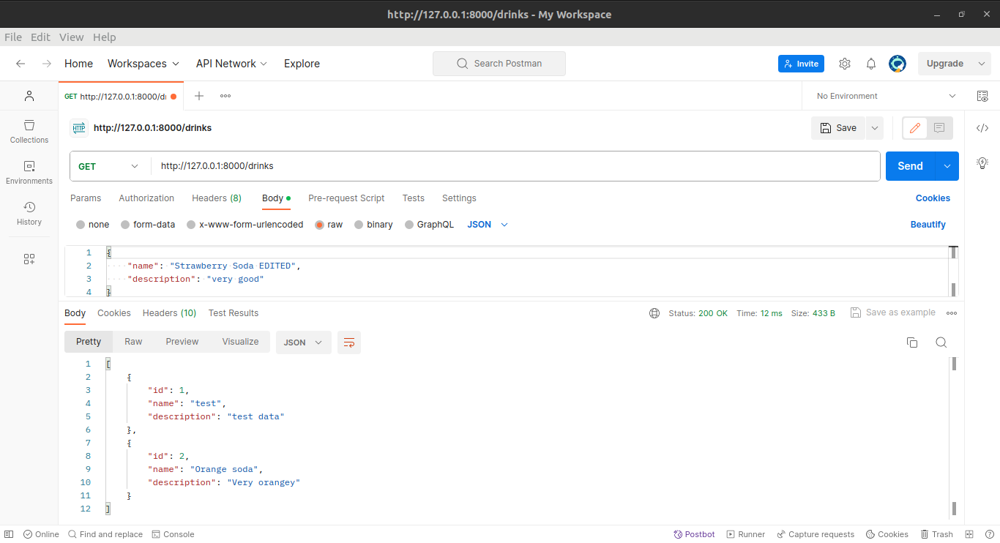
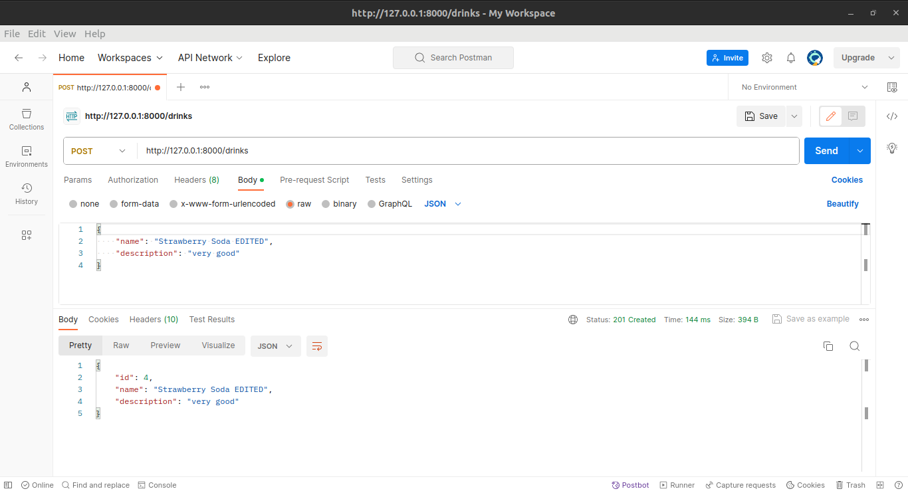
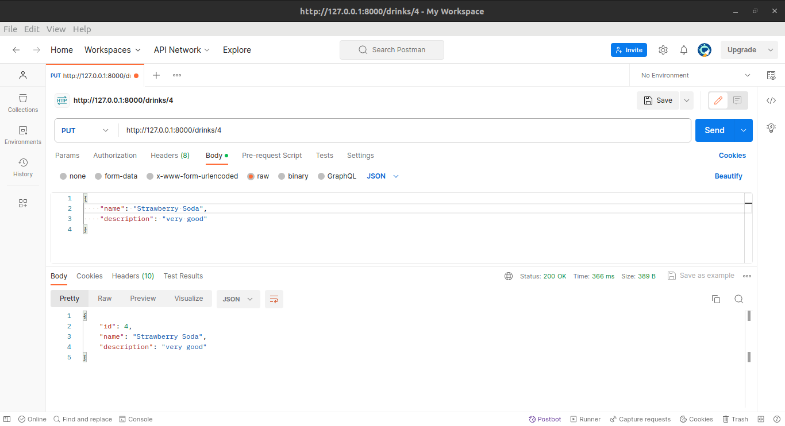
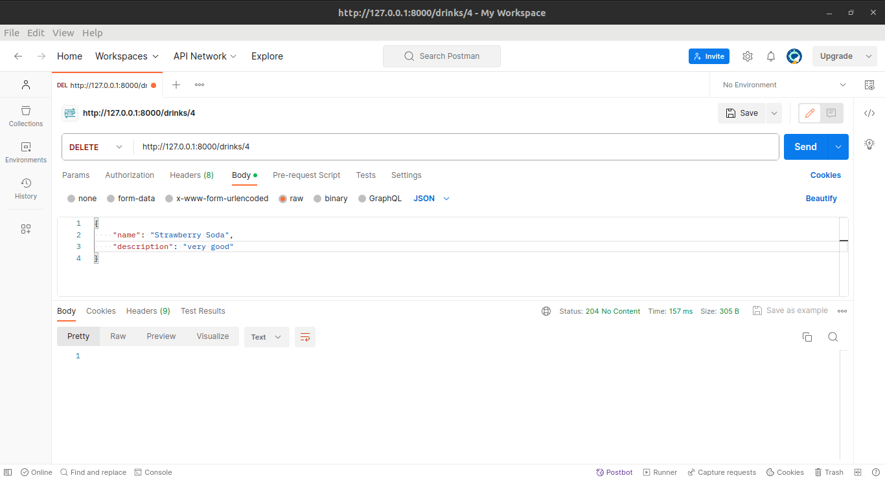
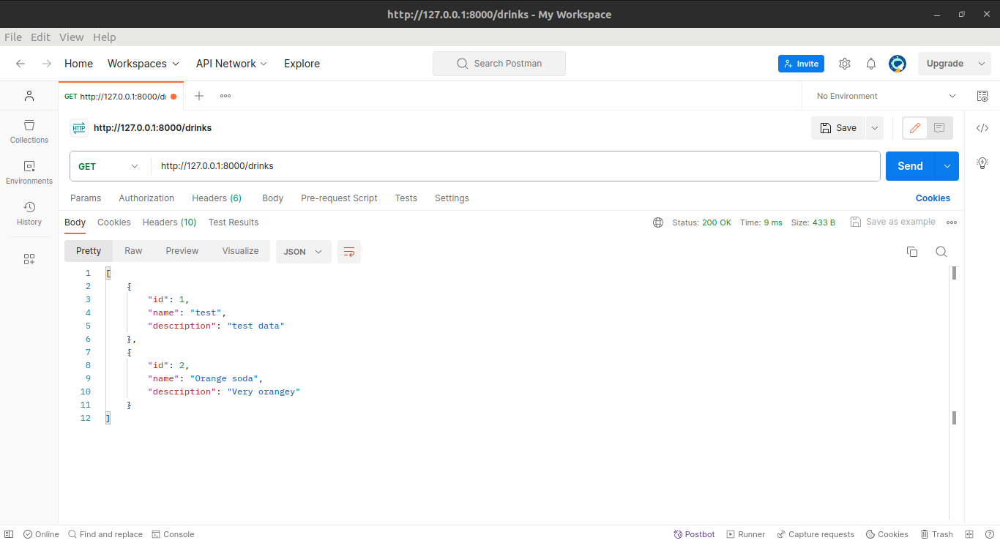

# Django_API


<p>A REST API is a standardized way to provide data to other
applications. Those applications can then use the data 
however they want. Sometimes, APIs also offer a way for 
other applications to make changes to the data.</p>

There are a few key options for a REST API request:
<li>
GET — The most common option, returns some data from the API based on the 
endpoint you visit and any parameters you provide</li>
<li>POST — Creates a new record that gets appended to the database</li>
<li>PUT(UPDATE) — Looks for a record at the given URI you provide. If it exists, 
update/overwrite the existing record. If not, create a new record</li>
<li>DELETE — Deletes the record at the given URI</li>

NB: We will use Postman for the API, but you can use any of your preference
## GET


## POST


## PUT(UPDATE)


## DELETE



# How to run it locally 🛠️
## [1] Clone the Project
```git clone https://github.com/penscola/Django_API.git```

## [2] Install the dependencies
```pip3 install -r requirements.txt```

## [3] Make migrations
```python3 manage.py migrate```

## [4] Run the project
```python3 manage.py runserver```

# Contact 📞
If you have any doubt or want to contribute feel free to email 
[me](penscolashackletonfelix@gmail.com) or hit me up on 
[LinkedIn](https://www.linkedin.com/in/felix-kiprotich-a2ba1a1a4/)